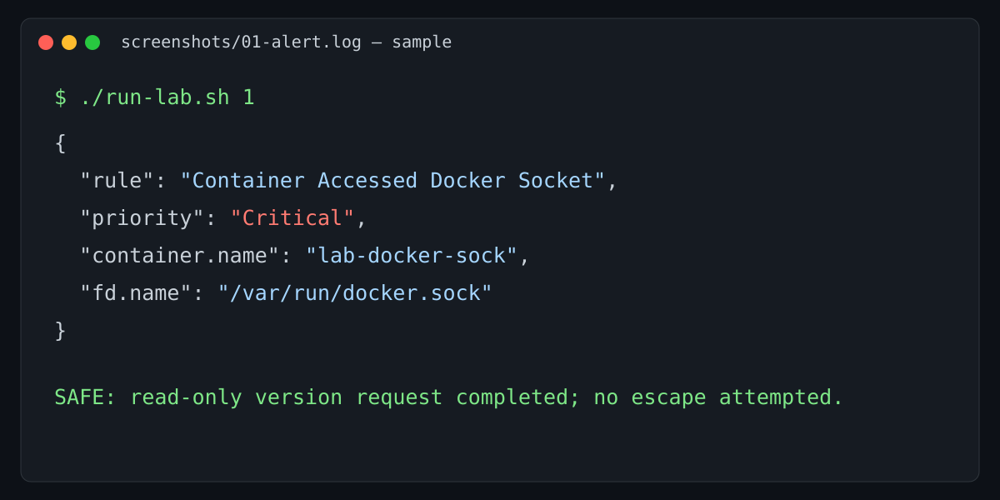

# Inputs, outputs, and expected results

This document provides reviewable evidence for the safe lab workflow. Values shown here are representative samples, not captured production data.

| Scenario | Input | Safe action | Expected result |
|---|---|---|---|
| 01 | `./run-lab.sh 1` | Docker version request through the exposed socket | CRITICAL socket-access alert |
| 02 | `./run-lab.sh 2` | Read-only cgroup control discovery | No write alert expected |
| 03 | `./run-lab.sh 3` | Bounded tmpfs mount attempt | CRITICAL mount alert or runtime denial |
| 04 | `./run-lab.sh 4` | Process-list visibility check | No ptrace alert expected |
| 05 | `./run-lab.sh 5` | Namespace metadata display | No namespace-entry alert expected |
| 06 | `./run-lab.sh 6` | Read-only `core_pattern` display | No proc-write alert expected |

## Example input

```bash
chmod +x run-lab.sh scripts/validate.sh scenarios/*/exploit.sh
./scripts/validate.sh
./run-lab.sh 1
```

## Example Falco output

```json
{
  "rule": "Container Accessed Docker Socket",
  "priority": "Critical",
  "output_fields": {
    "container.name": "lab-docker-sock",
    "fd.name": "/var/run/docker.sock",
    "proc.cmdline": "curl --unix-socket /var/run/docker.sock"
  }
}
```

## Result interpretation

An alert confirms the detection rule observed its target behavior; it does **not** prove an escape occurred. A missing alert can result from a denied action, Falco driver setup, event filtering, or a rule/field mismatch. Check the saved `screenshots/0N-alert.log`, driver health, and the Falco version before changing a rule.


